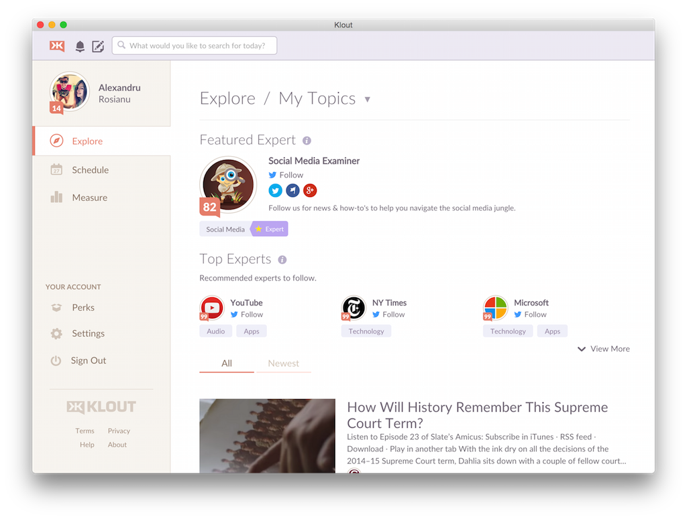

# NW.js Starter

This is a sample project to get you up and running with [NW.js](http://nwjs.io/).

If you need help, read my tutorial [here](http://blog.aluxian.com/how-to-create-cross-platform-desktop-apps-with-nw-js/). This is a screenshot of the app that the tutorial guides you through, Klout:

## Features

* native notifications
* auto update
* gulp tasks to
  * build each release
  * sign the OS X app
  * pack
    * Windows: nsis installer
    * OSX: dmg
    * Linux: deb package
  * upload to GitHub
* remembers window position when closed
* customizable settings in the right-click menu
  * run as menu bar app
  * launch on OS startup
  * open links in the browser

What doesn't work:

* tray icon on linux
* rpm builds

Not done yet:
* Windows binary signing

## Pre-requisites

    # install gulp
    npm install -g gulp

    # install dependencies
    npm install

* **wine**: If you're on OS X/Linux and want to build for Windows, you need [Wine](http://winehq.org/) installed. Wine is required in order
to set the correct icon for the exe. If you don't have Wine, you can comment out the `winIco` field in `gulpfile`.
* **makensis**: Required by the `pack:win32` task in `gulpfile` to create the Windows installer.
* [**fpm**](https://github.com/jordansissel/fpm): Required by the `pack:linux{32|64}:deb` tasks in `gulpfile` to create the Linux installers.

Quickly install this on OS X:

    brew install wine makensis
    sudo gem install fpm

## Build

### OS X: pack the app in a .dmg

    gulp pack:osx64

### Windows: create the installer

    gulp pack:win32

### Linux 32/64-bit: pack the app in a .deb

    gulp pack:linux{32|64}:deb

The output is in `./dist`. Take a look at `gulpfile.coffee` for additional tasks.

## Tips

Use the `--toolbar` parameter to quickly build the app with the toolbar on. E.g. `gulp build:win32 --toolbar`.

Use `gulp build:win32 --noicon` to quickly build the Windows app without the icon, which normally takes some seconds.

For OS X, use the `run:osx64` task to build the app and run it immediately.

Use these to create the .tiff images for the OS X menu bar:

    $ tiffutil -cathidpicheck icon_menubar.png icon_menubar@2x.png -out icon_menubar.tiff
    $ tiffutil -cathidpicheck icon_menubar_alert.png icon_menubar_alert@2x.png -out icon_menubar_alert.tiff

## Contributions

Contributions are welcome! For feature requests and bug reports please [submit an issue](https://github.com/Aluxian/nwjs-starter/issues).

## License

The MIT License (MIT)

Copyright (c) 2015 Alexandru Rosianu

Permission is hereby granted, free of charge, to any person obtaining a copy
of this software and associated documentation files (the "Software"), to deal
in the Software without restriction, including without limitation the rights
to use, copy, modify, merge, publish, distribute, sublicense, and/or sell
copies of the Software, and to permit persons to whom the Software is
furnished to do so, subject to the following conditions:

The above copyright notice and this permission notice shall be included in all
copies or substantial portions of the Software.

THE SOFTWARE IS PROVIDED "AS IS", WITHOUT WARRANTY OF ANY KIND, EXPRESS OR
IMPLIED, INCLUDING BUT NOT LIMITED TO THE WARRANTIES OF MERCHANTABILITY,
FITNESS FOR A PARTICULAR PURPOSE AND NONINFRINGEMENT. IN NO EVENT SHALL THE
AUTHORS OR COPYRIGHT HOLDERS BE LIABLE FOR ANY CLAIM, DAMAGES OR OTHER
LIABILITY, WHETHER IN AN ACTION OF CONTRACT, TORT OR OTHERWISE, ARISING FROM,
OUT OF OR IN CONNECTION WITH THE SOFTWARE OR THE USE OR OTHER DEALINGS IN THE
SOFTWARE.
